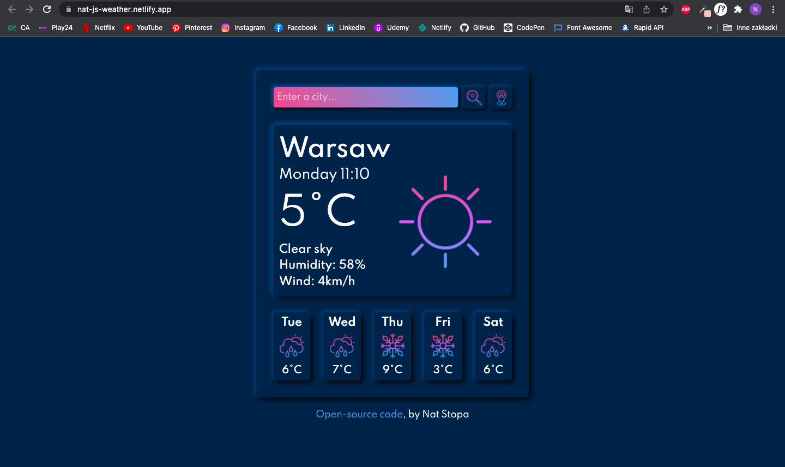

# vanilla-weather-app
#### Weather Page built with HTML, CSS and JavaScript

### This web page is hosted here!
> https://nat-js-weather.netlify.app/

## Table of Contents
* [General Info](#general-information)
* [Technologies Used](#technologies-used)
* [Features](#features)
* [Screenshots](#screenshots)
* [Project Status](#project-status)
* [Sources](#sources)
* [Author](#author)

## General Information
This is my first project ever. I made it as a final project for my first workshop. 
 
It shows current weather and five days forecast of a searched city, it can also show weather by your location.

## Technologies Used
* HTML5
* CSS3
* Vanilla JavaScript
* Axios
* Bootstrap
* [Open Weather API](https://openweathermap.org/api)

## Features
* You can check current weather by searching it or by your location.
* It shows chosen city name, day of the week, time, temperature, humidity, wind, description of the weather and weather icon.
* It also shows 5 days forecast with day of the week, weather icon and temperature.

## Screenshots

## Project status
Project is: _no longer being worked on_ 

## Sources
* Fonts: Spartan by [Google Fonts](https://fonts.google.com/specimen/Spartan?query=spartan) 
* Icons: <a href="https://www.flaticon.com/packs/weather-161?style_id=982&family_id=250&group_id=292" title="moon icons">Moon icons created by iconixar - Flaticon</a>
* Design by me
>This Website is made for [SheCodes Basics Course](https://www.shecodes.io/workshop) 

## Author
Created by [Nat Stopa](https://natstopa-portfolio.netlify.app/)
